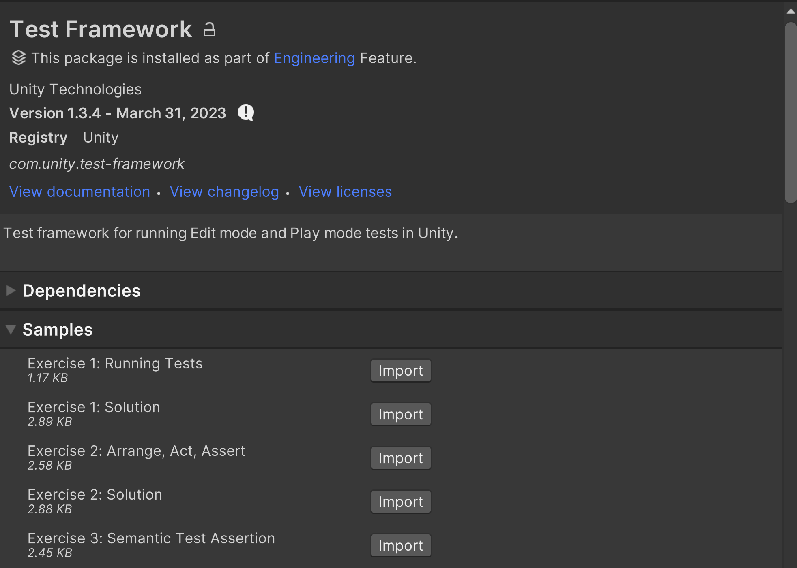

# Welcome

Welcome to the Unity Test Framework general introduction course.  
  
This course consists of different exercises to help you learn fundamental Unity Test Framework concepts through practical examples. Each exercise has a **Learning Objectives** section to help you identify the skills you will learn. The exercises are grouped thematically, and their difficulty varies.  
  
After completing an exercise, you can check your solution against the one provided. Note that many of the exercises can be solved in several possible ways.

## Import samples

Project files for each exercise and its accompanying solution are provided as samples with the Unity Test Framework package. To import an exercise or solution to your Unity Editor:

1. Go to **Window > Package Manager** and, in the [packages list view](https://docs.unity3d.com/Manual/upm-ui-list.html), selct Unity Test Framework.
2. In the package [details view](https://docs.unity3d.com/Manual/upm-ui-details.html), find the **Samples** section.
3. Find the exercise or solution you want to import and click the import button.

> Note: You can import an exercise and its solution or multiple exercises at the same time, but since several of the exercises use the same naming pattern this will likely result in compilation errors that prevent you running tests or building your project. The recommended workflow is to import and work on one exercise at a time. If you import additional exercises or solutions for reference, you can delete them again before running your main exercise.

## Course outline

1. [Running a test in a Unity project](./running-test.md)
2. [Arrange, act, assert](./arrange-act-assert.md)
3. [Semantic test assertion](./semantic-test-assertion.md)
4. [Custom comparison](./custom-comparison.md)
5. [Asserting logs](./asserting-logs.md)
6. [Setup and teardown](./setup-teardown.md)
7. [Play mode tests](./play-mode-tests.md)
8. [Play mode tests in a player](./play-mode-tests-in-player.md)
9. [Using the UnityTest attribute](./unitytest-attribute.md)
10. [Long-running tests](./long-running-tests.md)
11. [Scene-based tests](./scene-based-tests.md)
12. [Setup and cleanup at build time](./build-setup-cleanup.md)
13. [Domain reload](./domain-reload.md)
14. [Preserve test state](./preserve-test-state.md)
15. [Test cases](./test-cases.md)
16. [Custom attributes](./custom-attributes.md)
17. [Running tests programmatically](./running-tests-programmatically.md)

## Introduction to the Unity Test Framework (UTF)

Here you can find a [video introduction](https://www.youtube.com/watch?v=wTiF2D0_vKA) to the Unity Test Framework.
