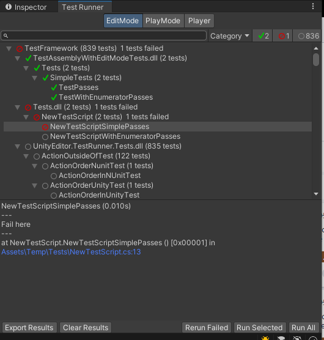

# What's new in version 1.4

This page summarizes new features, improvements, and issues resolved in version 1.4 of Unity Test Framework. 

## Added
### API updates

In this version, we introduced several API changes:
* Added API for saving results
* Added API for canceling test runs
* Added overloads of LogAssert.Expect which allow users to expect a log message without specifying a severity, which will match logged messages of any severity.

### Ignore tests based on arguments

This version introduces the ParameterizedIgnoreAttribute which allows ignoring tests based on arguments which were passed to the test method of a [parameterized test](./reference-tests-parameterized.md).

## Updated
### Revised Test Runner UI
This version includes a revised Test Runner window and several usability improvements:
* Added a third tab to the Test Runner window, for running in a player explicitly. This makes it easier to run a subset of tests, as well as retaining the test results from the latest player run.
* Moved the run and action buttons to the bottom of the window, to separate them from the filters.
* The stack traces are clickable, and will open the relevant file in the external editor.
* When searching, the parents of the matching tests are expanded, to make it easier to see the context of the matching tests.

]

## Fixed
This version includes many bug fixes and performance improvements. For a full list of changes and updates in this version, see the Unity Test Framework package [changelog](https://docs.unity3d.com/Packages/com.unity.test-framework@1.4/changelog/CHANGELOG.html).