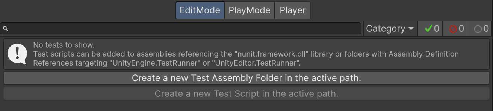
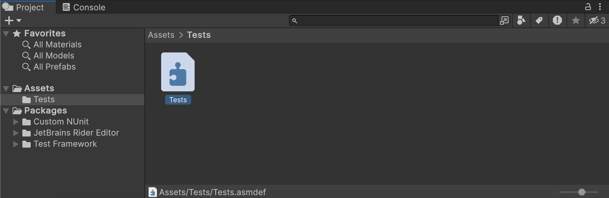
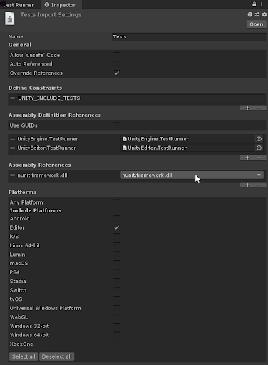

# Workflow: Creating test assemblies 

UTF looks for tests in a **Test Assembly**, which is any assembly that references Nunit.

The Test Runner UI helps you set up test assemblies:

1. Select the Assets folder in your Project window.
2. Open the Test Runner window (menu: **Window** > **General** > **Test Runner**).
3. In the **Test Runner** window, select **Create a new Test Assembly Folder in the active path**.

Alternatively, you can go via the **Assets** menu:

1. Select the Assets folder in your Project window.
2. Create a new Test Assembly Folder (menu: **Assets** > **Create** > **Testing** > **Test Assembly Folder**).

This creates a *Tests* folder in your project Assets with a corresponding `.asmdef` file with the required references. You can change the name of the new [Assembly Definition](https://docs.unity3d.com/Manual/ScriptCompilationAssemblyDefinitionFiles.html) and press Enter to accept it.

Click on the assembly definition file to inspect it in the **Inspector** window. You'll see that it has references to **nunit.framework.dll***,* **UnityEngine.TestRunner,** and **UnityEditor.TestRunner** assemblies. This tells UTF that this is a test assembly.

The checkbox selections under **Platforms** determine which platforms the test assembly can run on. Assemblies created through the **Test Runner** target the **Editor** only by default. **Any Platform** or a specific platform other than **Editor** makes it possible to run any Play Mode tests in the assembly on standalone Players for the additional platforms.

> **Note**: The **UnityEditor.TestRunner** reference is only available for [Edit Mode tests](./edit-mode-vs-play-mode-tests.md#edit-mode-tests).

You can repeat the steps above as many times as you like to create additional Test Assemblies. The first Test Assembly folder you create is named *Tests* by default and subsequent ones are named *Tests 1*, *Tests 2*, and so on. Remember that you can always rename the assemblies but each assembly name must be unique.

> **Note**: Changing the file name of the assembly definition file does not affect the value of the **Name** property in the file. Use the **Inspector** window or edit the .asmdef direclty in a text editor to make sure the name property is properly changed.