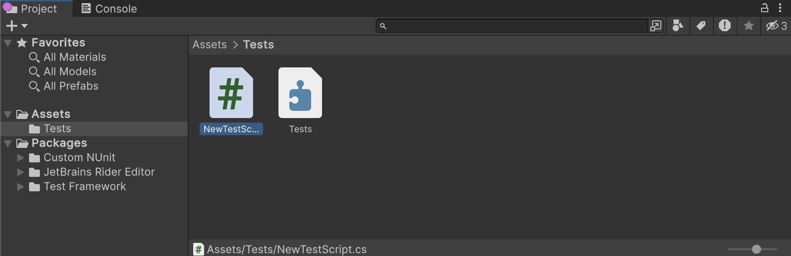
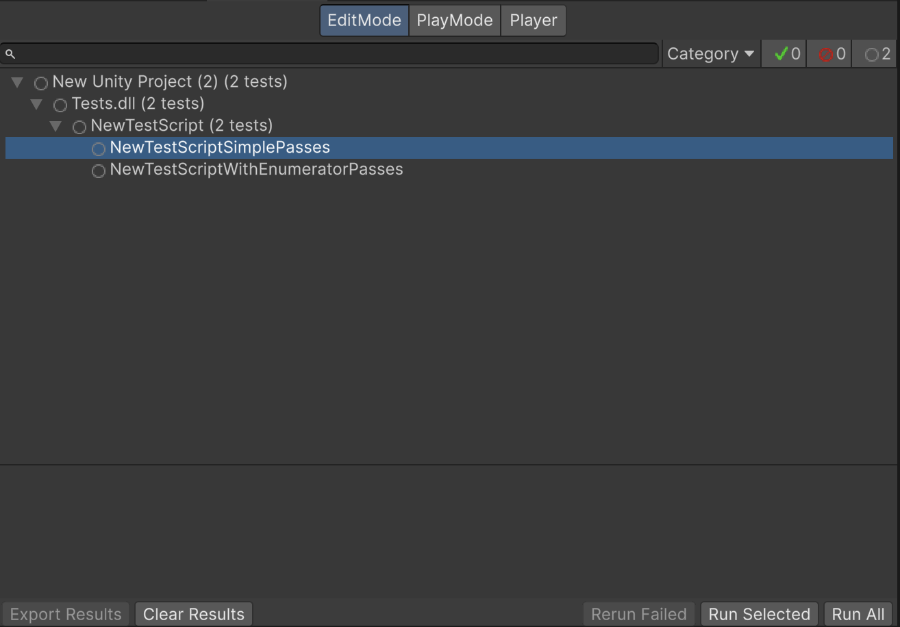

# Workflow: Creating tests

To create a test through the **Test Runner** window:

1. [Create your Test Assembly folder](./workflow-create-test-assembly.md) and select it in the **Project** window.
2. Open the Test Runner window (menu: **Window** > **General** > **Test Runner**).
3. Click the **Create a new Test Script in the active path** button in the **Test Runner** window.

Alternatively, use the **Asset** menu:

1. In the **Project** window, select the new folder.
2. Create a new test script in the folder (menu: **Assets > Create > Testing > C# Test Script**).

This creates a `NewTestScript.cs` file in the *Tests* folder with some sample tests to get you started. Change the name of the script, if necessary, and press Enter to accept it.

Now you’ll see the sample tests in the Test Runner window:

Now you can open the tests in your favorite script editor.

> **Note**: Unity does not include test assemblies (NUnit, Unity Test Framework, and user script assemblies) when using the normal build pipeline, but does include them when using **Run on &lt;Platform&gt;** in the **Test Runner** window.

## Creating Play Mode tests

The process for creating a Play Mode test is the same as for creating an Edit Mode test. The only relevant differences are:

* Play Mode tests that need to [run in a standalone platform Player](./workflow-run-playmode-test-standalone.md) should be in an assembly that references the required platform.

