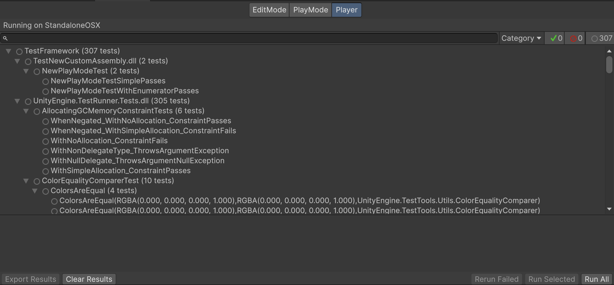
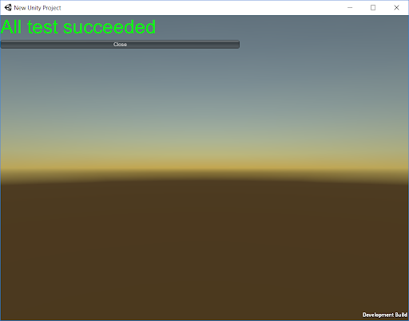
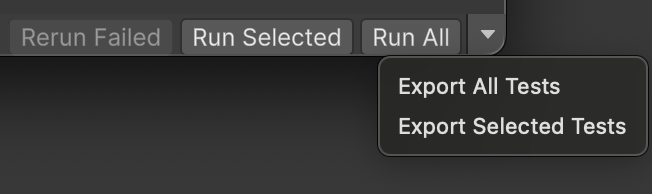

# Workflow: Running Play Mode tests in a player

## Build and run Tests in a player

If you run a **Play Mode** test in the same way as an [Editor test](./workflow-run-test.md), it runs inside the Unity Editor. You can also run Play Mode tests on specific platforms. Select **Player** tab to build and run your tests on the currently active target platform. 

> **Note**: Your current platform shows at the top of the Test Runner window. For example, in the image above, the bar above the search bar reads **Running in StandaloneOSX**, because the current platform is MacOS. The target platform is always the current Platform selected in [Build Settings](https://docs.unity3d.com/Manual/BuildSettings.html) (menu: **File** > **Build Settings**). 

The test result displays in the build once the test completes:

The application running on the platform reports back the test results to the Editor UI then displays the executed tests and shuts down. To make sure you receive the test results from the Player on your target platform back into the Editor that’s running the test, both should be on the same network. 

> **Note:** Some platforms do not support shutting down the application with `Application.Quit`, so it will continue running after reporting the test results.

If Unity cannot instantiate the connection, you can see the tests succeed in the running application. Running tests on platforms with arguments, in this state, does not provide XML test results.

## Build a player with tests

You can use the dropdown selector next to the **Run All** button to build a player with all the tests, or a selected subset of tests, without running it.

> **Note**: In some cases the available selections are different:
- If the selected platform is Android or iOS and **Export project** is enabled in **Build Settings**, the selections are **Export All Tests** and **Export Selected Tests**.

For more information, see [Edit Mode vs Play Mode tests](./edit-mode-vs-play-mode-tests.md).