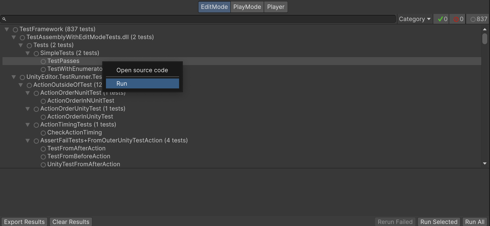

# Workflow: Running tests

There are several ways to run tests in the **Test Runner** window:

* Double-click on the test or test fixture name.
* Use the **Run All** or **Run Selected** buttons at the bottom of the window.
* Right-click on any item in the test tree and choose **Run** in the context menu to run the test and all of its children. 

When you run a test the test status icon changes to show the result and a counter in the top right corner updates:

## Filters

If you have a lot of tests, and you only want to view/run a sub-set of them, you can filter them in several ways (see image above): 

* Type in the search box in the top left

* Click a test class or fixture (such as **NewTestScript** in the image above)

* Click one of the test result icon buttons in the top right

## Run tests within Rider

It is possible to run unit tests in the Unity Test Framework directly from [JetBrains Rider](https://www.jetbrains.com/rider/). 

For more information, see the [JetBrains official documentation](https://www.jetbrains.com/help/rider/Running_and_Debugging_Unity_Tests.html) and their blog post [Run Unity tests in Rider 2018.1](https://blog.jetbrains.com/dotnet/2018/04/18/run-unity-tests-rider-2018-1/).
## Known issues and limitations
* The total duration of test suites shown in the Test Runner window does not take into account the time taken to run any OneTimeSetup, UnityOneTimeSetup, OneTimeTearDown or UnityOneTimeTearDown methods, but instead shows the sum of the duration of all tests in the suite.
