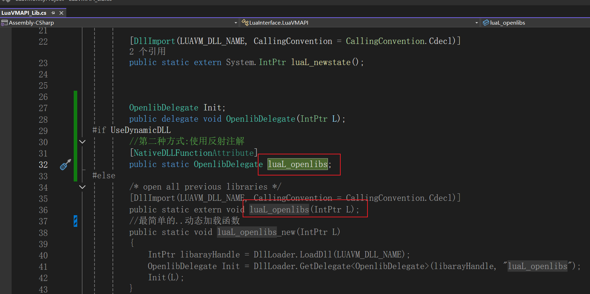

# LuaJit2vm

# Native工程介绍

## 目录结构

LuaLib文件夹下是我们的lua工程。

1.LuaLib\src文件夹： luavm源码。我们不再使用luajit。
2.LuaLib\luaCWrap文件夹： 将luavm的函数导出的C语言封装
    绝大部分函数，不需要额外封装了，直接使用luavm的即可。源码中使用LUALIB_API修饰的函数即导出函数。

   少部分涉及string size_t等类型的做封装。

## 如何编译

1.双击 1.cmakeDo.cmd，即可生成Build文件夹。文件夹内双击BuildPinvoke.sln即可打开VS工程。

2.双击2.GeacreateDLL.cmd，即可不打开VS工程的情况下自动编译出DLL。DLL会自动放在Unity的插件目录下，无需再手动copy。

3.双击3.GetDllFunction.cmd，可以观察DLL导出的函数是否正确。

# Unity工程介绍

LuavmUnityProject 是Unity工程。

## lua相关
Assets\LuaVM 文件夹下 是luavm的c#代码

1.Assets\LuaVM\LuavmInterface 是对luavm的封装
    1.1 LuaVMAPI.cs 是对luavm中的lapi.h的封装
    1.2 LuaVMAPI_Lib.cs 是对luavm中的Lauxlib.h函数的封装
    1.3 LuaVMAPI_Extern.cs 是对luavm中的lapi.h之外其他零散函数的封装

2.Assets\LuaVM\Examples
    测试用例，跟tolua保持一致

额外处理：

1.修改部分tolua不兼容代码

2.UNITY_WEBGL的[DllImport] 参数为_internal

3.源码直接放到插件目录的webgl目录下。

## PInvoke教程
PInvokeTutorial文件夹下演示PInvoke基础。
## 动态加载DLL
NativeDLLManager文件夹实现动态加载和卸载DLL的功能。
我们使用宏来控制是否动态加载DLL，并保持外部函数名一致。
比如lua的库加载，我们可以通过UseDynamicDLL这个宏来切换模式，而不影响外部逻辑。
